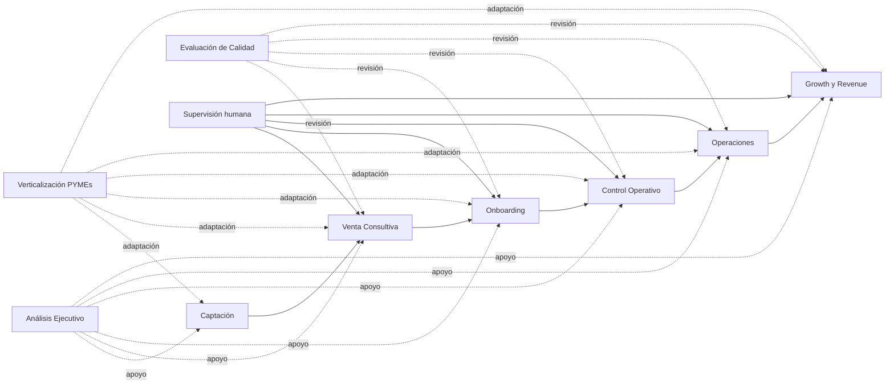

# ORQUESTA · Arquitectura ejecutiva visual

## Qué es ORQUESTA
ORQUESTA es una arquitectura de **agentes como servicio** para pymes y negocios de servicios.

No se limita a dar herramientas para que el cliente haga el trabajo.
Despliega agentes operativos especializados que hacen parte del trabajo por él, con supervisión humana en los puntos sensibles.

## La idea en una frase
**El producto real no es la aplicación. El producto real es una red de agentes trabajando para el cliente.**

## Cómo se entiende en 20 segundos
ORQUESTA convierte una parte del negocio en una cadena de agentes que:
- detectan oportunidades
- convierten ventas en arranques ordenados
- vigilan estados y bloqueos
- coordinan ejecución
- impulsan crecimiento

## Cadena principal

```text
Captación → Venta Consultiva → Onboarding → Control Operativo → Operaciones → Growth & Revenue
```

## Qué hace cada agente

### 1. Captación
**Misión:** detectar, capturar, clasificar y activar oportunidades.

Hace:
- recoge leads
- prioriza
- responde rápido
- deja el siguiente paso preparado

### 2. Venta Consultiva
**Misión:** convertir interés en oportunidad real.

Hace:
- discovery
- cualificación
- gestión de objeciones
- propuesta del siguiente paso comercial

### 3. Onboarding
**Misión:** convertir la venta en arranque claro y trazable.

Hace:
- pide datos y accesos
- genera checklist
- prepara kickoff
- deja el cliente listo para seguimiento operativo

### 4. Control Operativo
**Misión:** hacer visible qué necesita atención.

Hace:
- muestra estados
- detecta bloqueos
- registra incidencias
- ordena prioridades
- declara cuándo un caso está listo para operar

### 5. Operaciones
**Misión:** convertir casos activos en trabajo real ejecutable.

Hace:
- crea operaciones activas
- asigna responsables
- genera tareas
- registra avance y cierre

### 6. Growth & Revenue
**Misión:** mejorar crecimiento con criterio económico.

Hace:
- detecta fugas
- identifica palancas
- propone mejoras o experimentos
- orienta crecimiento a revenue real

## Agentes transversales
Además de la cadena principal, ORQUESTA ya contempla tres agentes de apoyo:

### Análisis Ejecutivo
Ayuda a decidir:
- qué hacer primero
- qué priorizar
- qué capa desbloquea más valor

### Evaluación de Calidad
Revisa si una pieza está:
- clara
- lista para cliente
- accionable
- suficientemente rigurosa

### Verticalización para pymes de servicios
Adapta toda la secuencia a negocios reales como:
- agencias
- consultoras
- despachos
- estudios
- servicios técnicos

## Cómo fluye el trabajo

```text
Lead entra
↓
Se cualifica
↓
Se convierte en cliente
↓
Se arranca bien
↓
Se hace visible el estado
↓
Se ejecuta el trabajo real
↓
Se optimiza crecimiento y revenue
```

## Dónde entra el humano
ORQUESTA no promete autonomía total.
Promete **autonomía útil con supervisión humana**.

El humano interviene sobre todo en:
- propuestas sensibles
- decisiones de alcance
- prioridades críticas
- acciones externas delicadas
- cierres o cambios con alto coste de error

## Qué valor aporta
ORQUESTA ayuda a que un negocio tenga:
- menos caos
- menos pérdida de contexto
- menos persecución manual
- más continuidad entre fases
- más trabajo delegado al sistema
- más capacidad operativa con poco equipo

## Qué no es
ORQUESTA no es solo:
- un dashboard
- una automatización suelta
- una app bonita
- una IA que conversa

ORQUESTA es una **capacidad operativa desplegada**.

## Mensaje ejecutivo
**ORQUESTA despliega agentes especializados que trabajan para el negocio, conectando captación, venta, arranque, control, ejecución y crecimiento bajo supervisión humana.**

## Diagrama ejecutivo



## Cierre
Si el SaaS clásico entrega herramientas para que el cliente haga el trabajo, ORQUESTA entrega una red de agentes para que una parte del trabajo ocurra por sistema y el humano pueda concentrarse en decidir, supervisar y dirigir.
